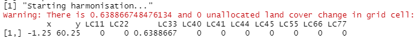
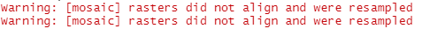

```{r,include = FALSE}
knitr::opts_chunk$set(
  collapse = TRUE,
  comment = "#>"
)

library("terra")
library("RColorBrewer")

continuous_LUC_palette <- colorRampPalette(brewer.pal(9, "RdBu"))(100)
continuous_LULC_palette <- colorRampPalette(brewer.pal(9, "YlGn"))(100)
discrete_LC_palette <- colorRampPalette(brewer.pal(10, "Set3"))(10)

LC_classes <- c("11", "22", "33", "40", "41", "44", "45", "55", "66", "77")
LC_classes_display <- c("Urban",
                        "Cropland",
                        "Pasture",
                        "Unknown/Other forest",
                        "Evergreen, needle leaf forest",
                        "Deciduous, broad leaf forest",
                        "Mixed forest",
                        "Grass/shrubland",
                        "Other land",
                        "Water")
LC_levels <- data.frame(id = as.numeric(LC_classes),
                        LULC = LC_classes_display)
```

## Introduction to landdownscaleR

Land use and land cover (LULC) projections are required for a wide range of 
models that predict the effect of land use on environmental variables, such as
biodiversity and hydrology. However, land use models do not always generate 
projections at adequate resolution for use in other models. The 
**landdownscaleR** R package implements an algorithm for spatial downscaling of 
LULC projections to fine resolutions that are suitable for environmental 
modelling.

The **landdownscaleR** algorithm takes coarse resolution maps of LULC change and
allocates the change to a fine resolution reference map. Minimal input data is 
required as new areas of LULC are allocated to grid cells in the reference map 
based on kernel densities, which quantify the density of each LULC class in the 
neighbourhood of a focal cell [@LePage2016]. Three methods of LULC allocation 
are provided in **landdownscaleR**:

* **Deterministic-random** (`"deterministic"`): new LULC areas are placed in
reference map grid cells in order from highest to lowest kernel density. Cells 
with a kernel density equal to zero are randomly ordered, hence the "random"
part of the method name.
* **Fuzzy** (`"fuzzy"`): new LULC areas are placed in reference map grid cells 
in order from highest to lowest kernel density, but each kernel density is 
adjusted before the cells are ordered. To adjust kernel densities, each one is 
summed with an adjustment drawn from a Normal distribution $N(0, f \sigma)$, 
where $\sigma$ is the standard deviation of the kernel densities and $f$ is 
specified by the user. Increasing $f$ leads to less aggregated patterns of LULC 
in the downscaled maps.
* **Random** (`"null_model"`): new LULC areas are added to the reference map at
random.

**landdownscaleR** is capable of downscaling multiple timesteps of LULC change 
because each downscaled map becomes the reference map for downscaling the 
subsequent timestep of LULC change. The radius of cells used to calculate kernel
densities and the $f$ parameter can both be altered to generate downscaled maps
with different LULC patterns. Given the minimal use of covariate data in 
**landdownscaleR** it is not intended to generate highly accurate LULC maps, but
instead to produce theoretical future landscapes that can be used to represent 
fine resolution LULC in environmental models.

## Using landdownscaleR: downscaling LULC change in the UK

Here, we demonstrate how to use the **landdownscaleR** R package to downscale
LULC change in the UK from 2009 to 2012. 

### Input maps

Downscaling requires two sets of input maps: a time series of LULC change maps, 
and a reference map at the resolution to which you want to downscale the LULC 
change maps. The LULC change maps used in this example are at 0.5^o^ resolution 
and were generated from the HILDA+ dataset [@winkler2020hglu] by summing the 
area of each LULC class within the 0.5^o^ grid cells. The LULC change maps cover
the time period from 2009 to 2012, with three files each containing one year of 
LULC change. Each LULC change file in this example contains ten layers, and 
every layer name is "LC" appended with a numeric code that refers to one LULC 
class: 

| Code | LULC class |
| --- | --- |
| 11 | Urban |
| 22 | Cropland |
| 33 | Pasture |
| 40 | Unknown/other forest |
| 41 | Evergreen, needle leaf forest |
| 44 | Deciduous, broad leaf forest |
| 45 | Mixed forest |
| 55 | Grass/shrubland |
| 66 | Other land |
| 77 | Water |

Load the 'terra' package into R before loading and viewing the LULC change map 
for 2009 to 2010 to see the naming format of each layer as well as other 
information about the map.

```{r Load LULC change 2009-2010}
library("terra")

LULC_change_2009_2010_file <- system.file("extdata/20221006_HILDA_UK_LUC_2009_2010.tif",
                                          package = "landdownscaleR")
LULC_change_2009_2010 <- rast(LULC_change_2009_2010_file)
LULC_change_2009_2010
```
Change in LULC can be plotted to assess how much LULC change is going to be 
downscaled each year; here, we plot the change in cropland and pasture in the UK 
between 2009 and 2010.

```{r Plot LULC change 2009 2010,echo=FALSE,fig.height=4,fig.width=7,fig.cap="Change in area (km^2^) of cropland and pasture in the UK at 0.5^o^ spatial resolution from 2009 to 2010."}
layout(matrix(c(1, 1, 2, 2, 2), 
       nrow = 1, 
       ncol = 5,
       byrow = TRUE))
plot(LULC_change_2009_2010[[c("LC22")]],
     col = continuous_LUC_palette,
     mar = c(1.1, 1.1, 1.1, 1.1),
     legend = FALSE,
     main = c(LC_classes_display[2]),
     axes = FALSE,
     range = c(-175, 175))
plot(LULC_change_2009_2010[[c("LC33")]],
     col = continuous_LUC_palette,
     mar = c(1.1, 1.1, 1.1, 9.1),
     main = c(LC_classes_display[3]),
     axes = FALSE,
     range = c(-175, 175))
```

The reference map must give LULC at the start of the time series of LULC change 
maps, so here we use LULC in the UK in 2009 as the reference map to downscale 
LULC change in the UK from 2009 to 2012. The reference map is at approximately
0.01^o^ resolution, contains one LULC class per cell, and was also derived from 
the HILDA+ LULC dataset [@winkler2020hglu]. Both the reference and LULC change
maps have to have the same geographic projection, but they do not need to cover 
exactly the same extent. The values in the UK 2009 reference map use the same 
numeric code as the LULC change maps to represent LULC classes.

```{r Load LULC in 2009}
reference_2009_file <- system.file("extdata/20221006_HILDA_UK_LULC_2009.tif",
                              package = "landdownscaleR")
reference_2009 <- rast(reference_2009_file)
reference_2009
```

```{r Plot LULC in 2009,echo = FALSE,fig.width=7,fig.height=6,fig.cap="UK LULC in 2009 at approximately 0.01^o^ resolution from the HILDA+ dataset."}
levels(reference_2009) <- LC_levels
plot(reference_2009,
     col = discrete_LC_palette,
     mar = c(3.1, 3.1, 2.1, 11),
     axes = FALSE)
```

### Run downscaling

The first step to downscale LULC change in the UK is to load the 
**landdownscaleR** package.

```{r setup}
library("landdownscaleR")
```

Next, set up the `match_LC_classes` matrix which matches the LULC classes in the
LULC change maps to those in the reference map. In this example all maps contain
the same LULC classes, so we set up a matrix which matches each LULC class to
itself. The **landdownscaleR** package will prepend each LULC class in a 
discrete (one LULC class per cell) reference map with "LC" because numeric LULC 
classes do not work in the algorithm, so if you are using a discrete reference
map make sure to add "LC" to the start of every reference map LULC class name in
the `match_LC_class` matrix.

```{r Create match_LC_classes}
LULC_map_classes <- paste0("LC",
                           c("11", "22", "33", "40", "41", "44", "45", "55", "66", "77"))
ref_map_classes <- paste0("LC",
                           c("11", "22", "33", "40", "41", "44", "45", "55", "66", "77"))

match_LC_classes <- matrix(data = c(1, 0, 0, 0, 0, 0, 0, 0, 0, 0,
                                    0, 1, 0, 0, 0, 0, 0, 0, 0, 0,
                                    0, 0, 1, 0, 0, 0, 0, 0, 0, 0,
                                    0, 0, 0, 1, 0, 0, 0, 0, 0, 0, 
                                    0, 0, 0, 0, 1, 0, 0, 0, 0, 0,
                                    0, 0, 0, 0, 0, 1, 0, 0, 0, 0,
                                    0, 0, 0, 0, 0, 0, 1, 0, 0, 0,
                                    0, 0, 0, 0, 0, 0, 0, 1, 0, 0, 
                                    0, 0, 0, 0, 0, 0, 0, 0, 1, 0,
                                    0, 0, 0, 0, 0, 0, 0, 0, 0, 1),
                           byrow = TRUE,
                           nrow = 10,
                           ncol = 10,
                           dimnames = list(LULC_map_classes,
                                           ref_map_classes))
```

Run the **landdownscaleR** algorithm using the `downscaleLC()` function. We use the
`"deterministic"` method of LULC allocation here, which means that grid cells
closest to existing patches of LULC will be the first to receive new LULC areas.
You may want to change the `output_file_prefix` and `output_dir_path` arguments 
to directories on your computer before running the code below.

```{r Run downscaling,eval=FALSE}
downscaleLC(ref_map_file_name = system.file("extdata/20221006_HILDA_UK_LULC_2009.tif",
                                            package = "landdownscaleR"),                         # File path of the fine resolution reference map
            LC_deltas_file_list = list(system.file("extdata/20221006_HILDA_UK_LUC_2009_2010.tif",
                                                   package = "landdownscaleR"),
                                       system.file("extdata/20221006_HILDA_UK_LUC_2010_2011.tif",
                                                   package = "landdownscaleR"),
                                       system.file("extdata/20221006_HILDA_UK_LUC_2011_2012.tif",
                                                   package = "landdownscaleR")),                 # List of file paths to the LULC change maps, in time series order
            LC_deltas_classes = LULC_map_classes,                                                # Vector of LULC classes in the LULC change maps
            ref_map_type = "discrete",                                                           # Whether the reference map contains one LULC class per cell or the area of each LULC class per cell
            cell_size_unit = "km",                                                               # Unit in which landdownscaleR should calculate grid cell sizes, here we use km
            match_LC_classes = match_LC_classes,                                                 # Matrix showing how the LULC change map classes are matched to the reference map classes
            kernel_radius = 1,                                                                   # Radius of cells to include in the kernel density calculation
            simulation_type = "deterministic",                                                   # Method of LULC allocation to use in landdownscaleR
            fuzzy_multiplier = 1,                                                                # f-value for the fuzzy method of LULC allocation. Not required in the "deterministic" or "null_model" methods so we leave it as the default of 1 here
            discrete_output_map = TRUE,                                                          # Whether to output discrete as well as area-based downscaled maps
            random_seed = 1675,                                                                  # Random seed, so that simulation results can be reproduced
            output_file_prefix = "UK_DS_example",                                                # Prefix for downscaled maps
            output_dir_path = "landdownscaleR_example/")                                         # Directory in which to store the output downscaled maps
```

When running the `downscaleLC()` function to downscale the example LULC change 
maps from the UK you might see warning messages such as the one below:

```{r Harmonisation warning,echo=FALSE}

```

These warning messages occur when the **landdownscaleR** algorithm is unable to 
allocate LULC change from one coarse resolution grid cell to the reference map.
At first, the algorithm attempts to allocate LULC change from one coarse
resolution cell to a set of reference map cells. Every reference map grid cell
is assigned to their nearest coarse resolution cell by **landdownscaleR**, so 
they can only receive new LULC from that coarse cell. In some cases 
**landdownscaleR** will be unable to allocate LULC change from a coarse 
resolution cell to its assigned reference map cells. For example, let us assume
that cropland increases by 100 km^2^ in a coarse resolution cell in one timestep
but the assigned reference map cells are already entirely covered by cropland. 
**landdownscaleR** will be unable to place more cropland in the reference map 
cells, so 100 km^2^ of cropland will be unallocated. After **landdownscaleR** 
has attempted to allocate LULC change from all coarse resolution cells to the 
reference map it starts a process called 'harmonisation', where the algorithm 
places unallocated LULC change in neighbouring coarse resolution cells. When 
**landdownscaleR** is unable to place all unallocated LULC change on the 
reference map during harmonisation it prints out a warning such as the one
above, showing which coarse resolution cells contain unallocated LULC change and 
how much.

In the example of downscaling LULC change in the UK from 2009 to 2012 the 
warning messages for unallocated LULC are expected to occur for a few cells 
where there is a difference in the total land area in HILDA+ between two years.
For instance, in the example message above there was a 0.64 km^2^ increase in 
pasture area  that was unallocated in grid cell -1.25, 60.25. There was no 
corresponding decrease in another LULC class, meaning that the total area of 
land in HILDA+ must have increased by 0.64 km^2^ in this coarse cell and year,
probably due to a coastal grid cell being added in HILDA+. It is recommended to
check these warning messages carefully as they could be due to mismatches in the
underlying data, or due to differences between LULC change projections and LULC
in the reference map.

Another warning message that might appear during downscaling is:

```{r mosaic warning,echo=FALSE}

```

This warning message is generated because the reference map cells are cropped 
into one `terra::SpatRaster` object per coarse resolution cell during the 
downscaling process, to ensure that LULC change in each coarse cell can be 
allocated independently from other coarse cells. Occasionally there may be cases
where reference map grid cells at the edge of two coarse resolution cells are 
counted in both coarse cells. We believe this results in the warning message
saying that rasters are not aligned when the individual reference map 
`terra:SpatRaster` objects are merged back together using the `terra::mosaic()` 
function at the end of downscaling one timestep. This warning is likely to 
affect a very small number of reference grid cells, and should not lead to any 
missing grid cells as the `terra::mosiac()` documentation states that the values
from the last `terra::SpatRaster` to be merged will be retained in places where 
two `terra::SpatRaster` objects overlap.

Lastly, you might see these error messages from the 'terra' R package during 
downscaling is: 

```{r terra error,echo=FALSE}

```

These error messages are a known problem with version 1.5-21 of the 'terra' R 
package and do not affect the results from downscaling. More information can be
found at [the 'terra' GitHub page](https://github.com/rspatial/terra/issues/30).
We intend to update **landdownscaleR** to use the latest versions of 'terra' in
the future, in which case these error messages should disappear.

## Calibration of landdownscaleR

The different methods of LULC allocation (`"deterministic"`, "`fuzzy`" and 
`"null_model"`) provided in **landdownscaleR** generate varying patterns of LULC
in the output downscaled maps. Multiple timesteps of LULC are provided by 
HILDA+, so we can use HILDA+ to test which method of LULC allocation best 
reproduces historic LULC patterns. For example, run `downscaleLC()` with the 
`"fuzzy"` method of LULC allocation and $f = 1.5$.

```{r Run downscaling fuzzy 1.5,eval=FALSE}
downscaleLC(ref_map_file_name = system.file("extdata/20221006_HILDA_UK_LULC_2009.tif",
                                            package = "landdownscaleR"),
            LC_deltas_file_list = list(system.file("extdata/20221006_HILDA_UK_LUC_2009_2010.tif",
                                                   package = "landdownscaleR"),
                                       system.file("extdata/20221006_HILDA_UK_LUC_2010_2011.tif",
                                                   package = "landdownscaleR"),
                                       system.file("extdata/20221006_HILDA_UK_LUC_2011_2012.tif",
                                                   package = "landdownscaleR")),
            LC_deltas_classes = LULC_map_classes,
            ref_map_type = "discrete",
            cell_size_unit = "km",
            match_LC_classes = match_LC_classes,
            kernel_radius = 1,
            simulation_type = "fuzzy",
            fuzzy_multiplier = 1.5,
            discrete_output_map = TRUE,
            random_seed = 5255,
            output_file_prefix = "UK_DS_example",
            output_dir_path = "landdownscaleR_example_fuzzy/")
```

Before visualising the downscaled maps, first load two packages that we will use
for plotting into R.

```{r Load packages}
library("terra")
library("RColorBrewer")
```

Load the downscaled maps generated with the `"deterministic"` and `"fuzzy"` 
methods in 2012 and the actual HILDA+ map from the same year.

```{r Load and plot 2012 maps}
hilda_2012 <- rast(system.file("extdata/20230211_HILDA_UK_LULC_2012.tif",
                               package = "landdownscaleR"))
deterministic_2012 <- rast("landdownscaleR_example/UK_DS_example_Discrete_Time3.tif")
fuzzy_2012 <- rast("landdownscaleR_example_fuzzy/UK_DS_example_Discrete_Time3.tif")

hilda_2012
deterministic_2012
fuzzy_2012
```

The HILDA+ map from 2012 contains different values to the downscaled maps. We 
can add categories to the HILDA+ map using the `terra::levels()` function so 
that the values match those in the downscaled maps.

```{r Add levels to HILDA+ 2012}
LC_classes <- c("11", "22", "33", "40", "41", "44", "45", "55", "66", "77")
LC_levels <- data.frame(id = as.numeric(LC_classes),
                        Land_cover = ref_map_classes)

levels(hilda_2012) <- LC_levels
hilda_2012
```

Plot the HILDA+ and two downscaled maps for comparison using the code below.

```{r Plot 2010 maps comparison,fig.height=8,fig.width=7,fig.cap="LULC in 2012 from HILDA+ and downscaling with the determininistic and fuzzy options. The fuzzy downscaling simulation used an f-value of 1.5."}
discrete_LC_palette <- colorRampPalette(brewer.pal(10, "Set3"))(10)

layout(matrix(c(1, 1, 2, 2, 
                3, 3, 3, 4),
              byrow = TRUE,
              nrow = 2,
              ncol = 4))
plot(hilda_2012,
     col = discrete_LC_palette,
     main = "HILDA+",
     legend = FALSE,
     axes = FALSE)
plot(deterministic_2012,
     main = "Deterministic",
     col = discrete_LC_palette,
     legend = FALSE,
     axes = FALSE)
plot(fuzzy_2012,
     main = "Fuzzy",
     col = discrete_LC_palette,
     axes = FALSE)
```

It can be difficult to see differences between the three maps of the UK above. 
We can plot just a small area of the UK instead to better see how the two 
downscaling methods agree with the actual HILDA+ data in 2012. First, set up a
`terra::SpatVector` object with four coordinates that form a rectangle around an
area of interest.

```{r Set up polygon}
zoom_x_coords <- c(-0, 0, 2.5, 2.5)
zoom_y_coords <- c(50.5, 51.5, 51.5, 50.5)

zoom_coords <- cbind(id = 1, 
                     part = 1, 
                     x = zoom_x_coords, 
                     y = zoom_y_coords)
  
zoom_polygon <- vect(zoom_coords, 
                     type = "polygons", 
                     crs = "EPSG:4326")
```

Use the `zoom_polygon` object to crop each map of LULC in 2012 to the region of
interest.

```{r Crop maps}
zoom_hilda_2012 <- crop(hilda_2012,
                        zoom_polygon)
zoom_deterministic_2012 <- crop(deterministic_2012,
                                zoom_polygon)
zoom_fuzzy_2012 <- crop(fuzzy_2012,
                        zoom_polygon)
```

Finally, plot the three cropped maps using the code below. Visually comparing 
the three maps suggests that the `"deterministic"` method of LULC allocation 
generated fewer, larger patches of LULC compared to the `"fuzzy"` method. The 
`"fuzzy"` map has smaller patches of LULC dispersed across the landscape and 
appears to be more similar to the actual HILDA+ map. Therefore, in this case we 
might conclude that the `"fuzzy"` method with $f = 1.5$ is more appropriate than 
the `"deterministic"` method for downscaling LULC change in the UK. Although we 
only visually compare the maps in this example, there are a variety of landscape 
pattern metrics available that can be calculated and used to compare downscaled
maps with historic LULC patterns. For example, the **landscapemetrics** R 
package [@hesselbarth_landscapemetrics_2019] can calculate a wide variety of 
landscape pattern metrics. Other metrics are also available to assess the 
accuracy of LULC maps, such as the Kappa and Figure of Merit indices 
[@garcia-alvarez_land_2022].

```{r fig.width=7,fig.height=5,fig.cap="LULC in the south-east of the UK in 2012 from HILDA+ and downscaling with the determininistic and fuzzy options."}
layout(matrix(c(1, 1, 2, 2, 
                3, 3, 3, 4),
              byrow = TRUE,
              nrow = 2,
              ncol = 4))
plot(zoom_hilda_2012,
     col = discrete_LC_palette,
     main = "HILDA+",
     mar = c(1.1, 1.1, 1.1, 1.1),
     legend = FALSE,
     axes = FALSE)
plot(zoom_deterministic_2012,
     main = "Deterministic",
     col = discrete_LC_palette,
     mar = c(1.1, 1.1, 1.1, 1.1),
     legend = FALSE,
     axes = FALSE)
plot(zoom_fuzzy_2012,
     main = "Fuzzy",
     col = discrete_LC_palette,
     mar = c(1.1, 1.1, 1.1, 10.1),
     axes = FALSE)
```

## References
